# ComfyUI_Muye for ComfyUI

以下是一些我自己常用的节点，全中文实现，这些节点都是AI写的。
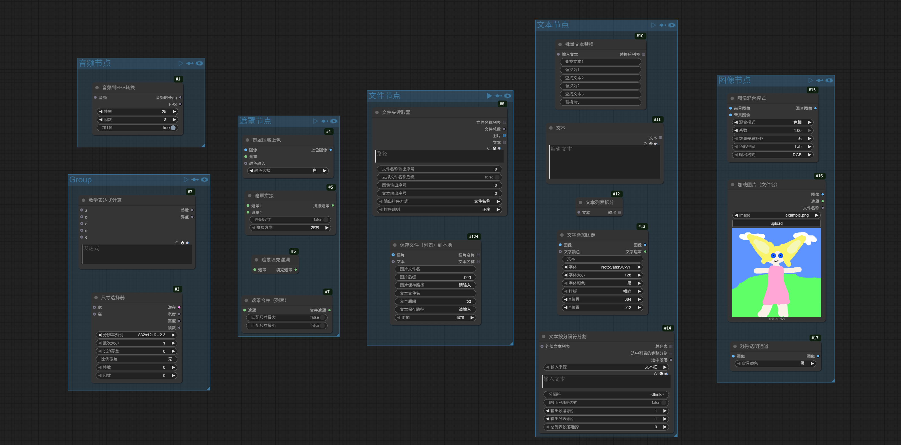

## 1，音频节点: 音频到FPS转换,
功能是，获取音频时长（以秒为单位）并输出，设置帧率和因数之后，输出与时长对应的FPS数值，这在一些对口型，或者数字人生成的工作流程中相当有用
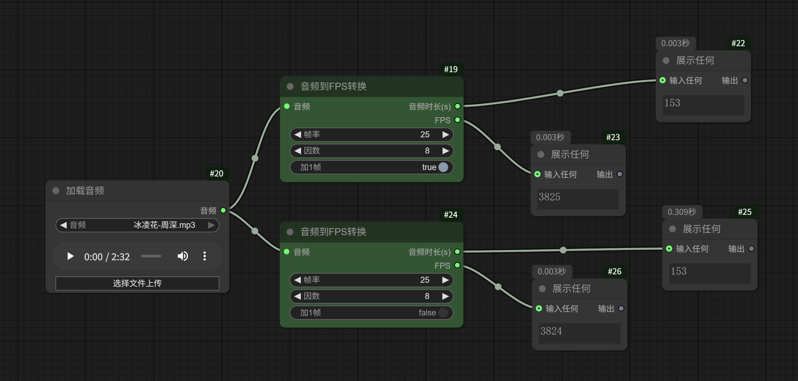

## 2，文件节点: 文件夹读取器, 保存文件（列表）到本地,
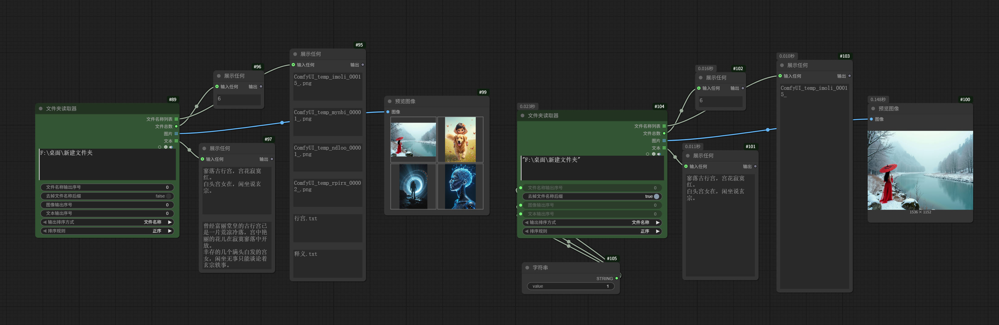
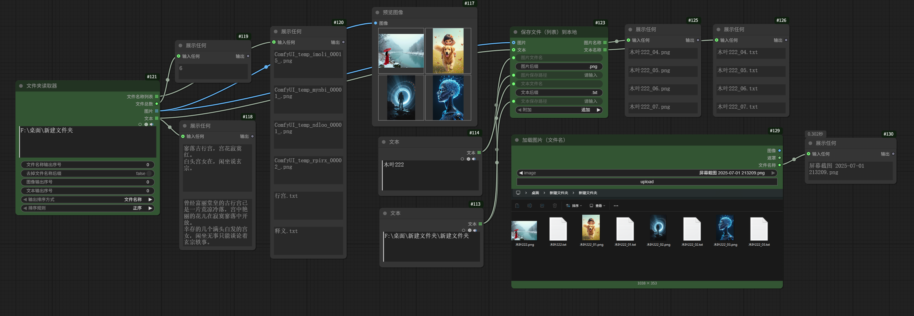

## 3，图像节点: 图像混合模式, 加载图片（文件名）,移除透明通道,
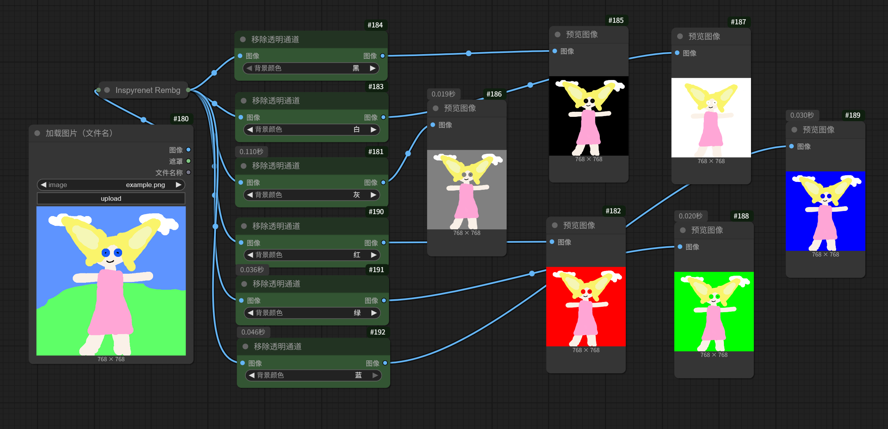
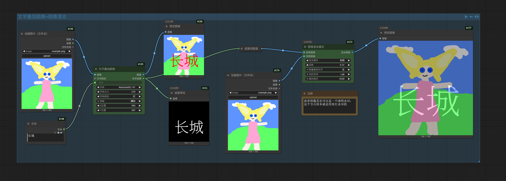

## 4，遮罩节点: 遮罩区域上色，遮罩拼接，遮罩填充漏洞，遮罩合并（列表）
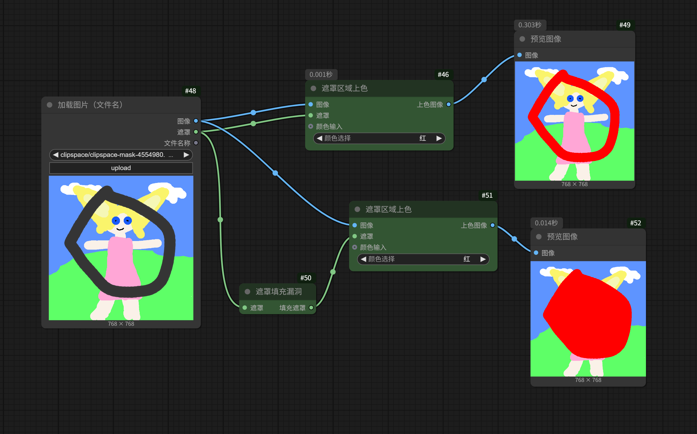
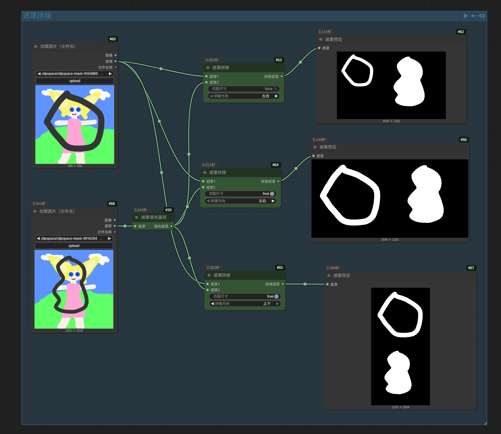
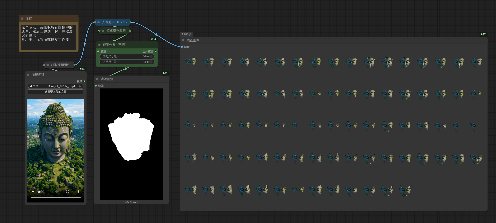

## 5，文本节点: 批量文本替换，文本，文本列表拆分，文字叠加图像，文本按分隔符分割
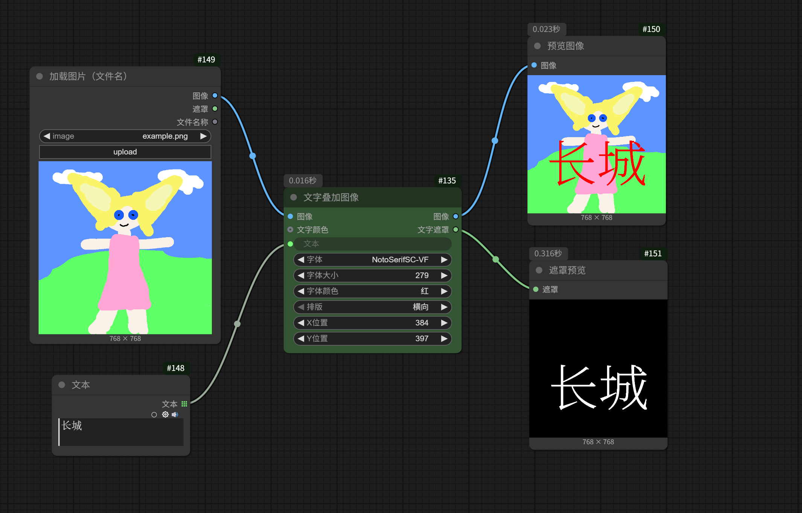 
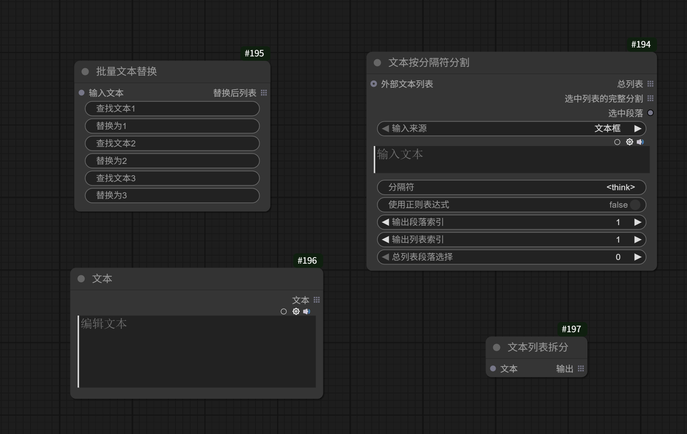 

## 6.，额外节点: 数学表达式计算，尺寸选择器
### 数学表达式：
支持整数，文本，浮点作为输入，然后进行运算，拥有5个输入接口
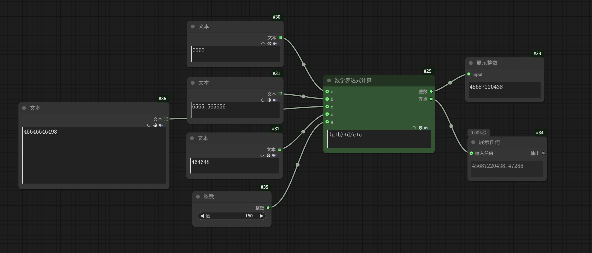

### 尺寸选择器 ：
主要功能
尺寸优先级为： 左侧输入端口>边长覆盖>分辨率预设
提供丰富的分辨率预设（如 16:9、4:3、1:1 等常见比例），一键选择。
支持自定义输入宽度、高度，或通过比例字符串（如“3:2”，“2.39/1”，“2 3”等） 灵活指定宽高比。
可设置“长边覆盖”，自动按比例调整另一边，适合需要指定最大边长的场景。如果输入了比例和长边，节点会自动计算出合适的宽高。
支持“因数”参数，自动将分辨率调整为某个数的倍数，方便兼容模型输入要求。所有分辨率都会根据“因数”参数自动对齐，保证兼容性。
支持批量生成（批次大小）和多帧（帧数）设置，兼容图片和视频生成任务。并自动限制最大分辨率，防止显存溢出。
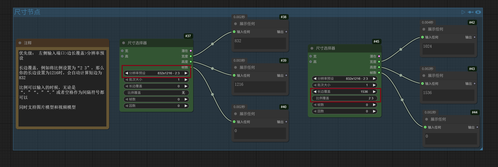 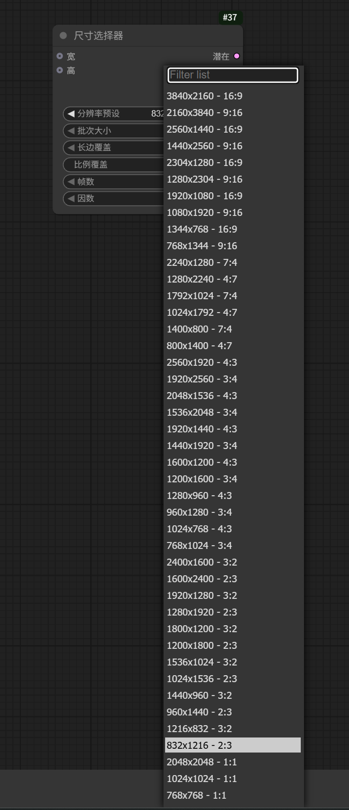

安装：
直接使用 git clone https://github.com/muyexiuluo/ComfyUI_Muye.git 将本仓库克隆到
你的\ComfyUI\custom_nodes\ 文件夹下

