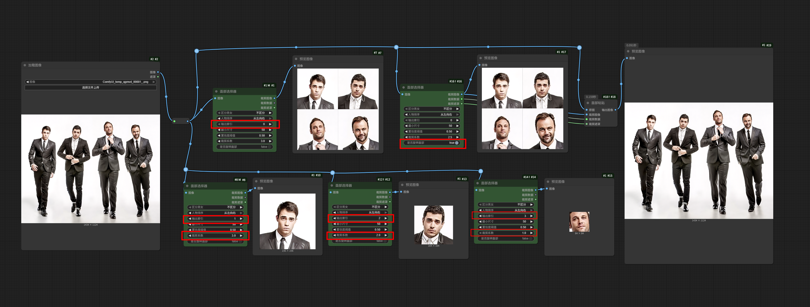
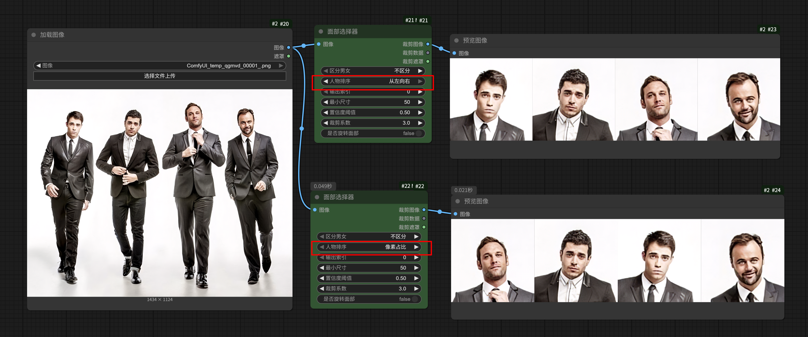

# ComfyUI_Muye

2025年7月15日 更新：
## 新增 face_selector 即 面部选择器 面部粘贴节点
 

参数说明：该节点采用MediaPipe模型对人脸进行检测和分割
区分男女：此功能暂时无效，我还在寻找和对比合适的性别识别模型，后续会集成到其中，所以暂时保留UI选项
人物排序：提供2种排序方式，一个是从左往右的顺序，左侧第一张人脸索引为 1。一个是按照人脸在原图中所占的像素大小排序。
输出索引：为0时，输出所有有效人脸的列表，1，2，3，4则为对应的人脸。
最小尺寸，表示小于当前设置的像素值平方的人脸将被忽略。
置信度阈值：MediaPipe模型好像对这个值不太感冒，无论大小好像都差不多
裁剪系数：输入数值1.0时表示按照当前检测出来的人脸外轮廓进行裁剪，检测出来的人脸有多大，就裁剪多大，而如果输入1.1，表示按照当前所选择的面部实际像素向外扩张百分之十的像素，然后输出。该输入框默认为2.0，表示扩张百分之200的像素进行输出。
是否旋转面部：将歪七扭八的人脸旋转到正常角度。
注意：因为该节点使用MediaPipe模型库，所以你要安装对应的依赖才能正常工作：mediapipe opencv-python torch numpy

以下是一些我自己常用的一些节点分享，这些节点都是AI写的，全中文实现节点。

## 1，音频节点: audio_to_fps 音频到FPS转换,
功能是，获取音频时长（以秒为单位）并输出，设置帧率和因数之后，输出与时长对应的FPS数值，这在一些对口型，或者数字人生成的工作流程中相当有用

## 2，文件节点: file_reader 文件夹读取器, save_files_to_local 保存文件（列表）到本地,

## 3，图像节点: image_blending_mode 图像混合模式, load_image 加载图片（文件名）, remove_alpha_channel 移除透明通道,

## 4，遮罩节点: mask_colorize 遮罩区域上色，mask_concatenate 遮罩拼接，mask_fill_holes 遮罩填充漏洞， mask_merge_list 遮罩合并（列表）

## 5，文本节点: batch_text_replace 批量文本替换， text_edit_output 文本， split_list 文本列表拆分， text_overlay_image 文字叠加图像，text_split_delimiter 文本按分隔符分割
 
 

## 6.，额外节点: math_calculator 数学表达式计算，size_selector 尺寸选择器
### 数学表达式：
支持整数，文本，浮点作为输入，然后进行运算，拥有5个输入接口

###  尺寸选择器 ：
主要功能
尺寸优先级为： 左侧输入端口>边长覆盖>分辨率预设
提供丰富的分辨率预设（如 16:9、4:3、1:1 等常见比例），一键选择。
支持自定义输入宽度、高度，或通过比例字符串（如“3:2”，“2.39/1”，“2 3”等） 灵活指定宽高比。
可设置“长边覆盖”，自动按比例调整另一边，适合需要指定最大边长的场景。如果输入了比例和长边，节点会自动计算出合适的宽高。
支持“因数”参数，自动将分辨率调整为某个数的倍数，方便兼容模型输入要求。所有分辨率都会根据“因数”参数自动对齐，保证兼容性。
支持批量生成（批次大小）和多帧（帧数）设置，兼容图片和视频生成任务。并自动限制最大分辨率，防止显存溢出。
 

安装： 
将本仓库克隆到 你的.\ComfyUI\custom_nodes\ 文件夹下
cd xx\ComfyUI\custom_nodes
git clone https://github.com/muyexiuluo/ComfyUI_Muye.git 
然后安装 requirements.txt 文件中的依赖