# ComfyUI-Muye-nodes

## 2026年7月13日 更新:新增 图像反推相关节点

多图参考:

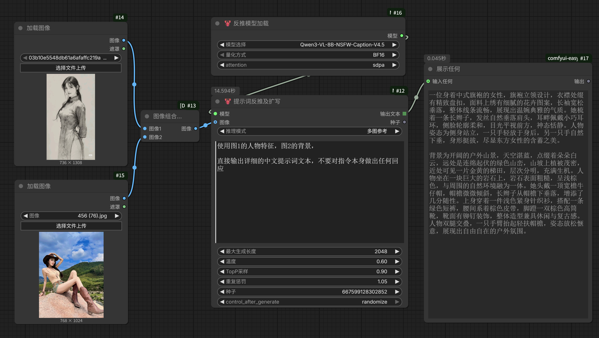

视频推理

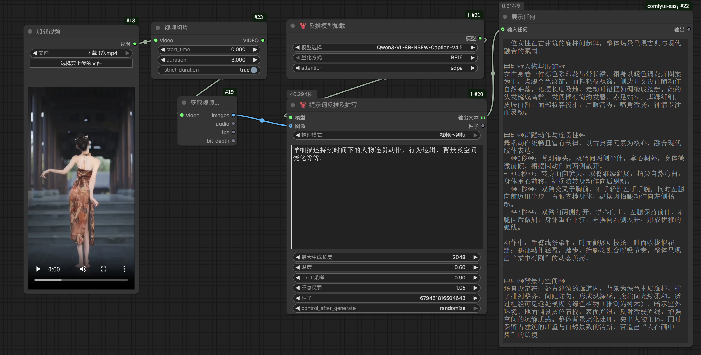

批量打标

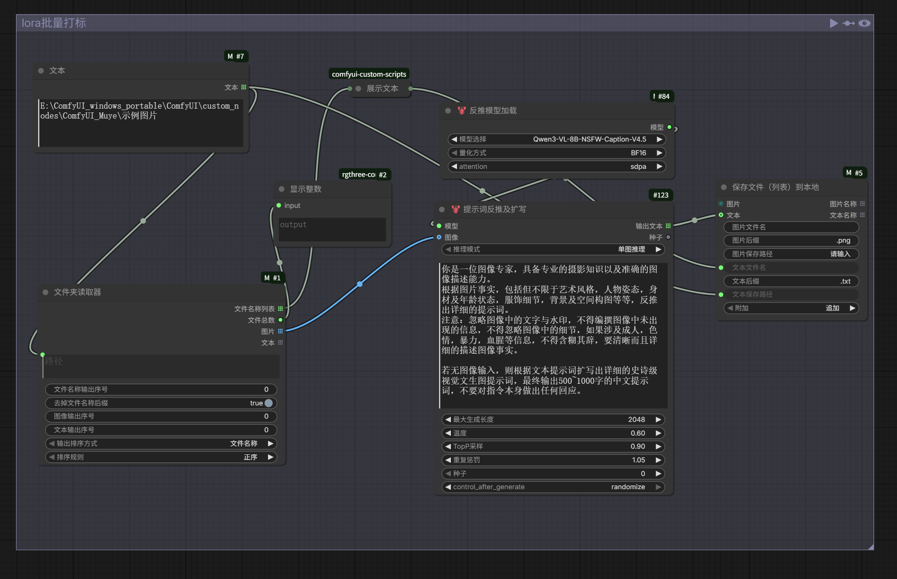

# 图像反推节点

基于 Qwen2.5-VL / Qwen3-VL / LLaVA 等多模态模型的图像描述与提示词处理节点。

## 节点列表

### 🦞 反推模型加载

加载多模态模型供下游节点使用。自动扫描 `Caption_checkpoints` 和 `LLavacheckpoints` 目录,支持 BF16/FP16/INT8/INT4 量化和多种注意力加速方式,模型加载后自动缓存。

### 🦞 提示词反推及扩写

基于 Qwen3-VL / Qwen2.5-VL / LLaVA 的通用指令节点,支持三种推理模式:

- **单图推理** - 逐张独立处理图片,每张图单独输出结果。有图时模型看图执行指令,无图时纯文本执行。适用于批量图片反推、提示词扩写、风格转换等。
- **多图参考** - 将多张图片一起作为交叉参考源,模型自动按输入顺序编号为【图1】、【图2】...,用户可在指令中指定"用图1的背景+图2的姿势"等方式融合多图元素。需 Qwen 系列模型支持。
- **视频序列帧** - 将输入的帧序列视为连续视频,让模型理解时间维度的动态变化。需 Qwen 系列模型支持(Qwen2.5-VL / Qwen3-VL)。

支持种子控制,输出结果可复现。

### 🦞 提示词校对

接收最多4个提示词来源,让模型对照原图进行交叉比对,去除幻觉和错误描述,输出准确的最终提示词。校对规则完全由用户自定义,可控性强。

## 支持的模型架构

- Qwen2.5-VL 系列
- Qwen3-VL / Qwen3.5-VL 系列
- LLaVA 系列

## transformers 版本要求

| transformers 版本 | 支持的模型 |
|---|---|
| >= 4.50.3 | Qwen2.5-VL、Qwen3-VL、Qwen3.5-VL、LLaVA(推荐) |
| < 4.50.3 | 仅支持 Qwen2.5-VL、LLaVA(不支持 Qwen3 系列) |

建议升级到最新 transformers 以使用全部模型。

## 推荐模型

### thesby/Qwen3-VL-8B-NSFW-Caption-V4.5 ⭐ 首选推荐

**适合人群:** 追求最高描述质量,显存充足(BF16 约需 16GB+),需要处理复杂场景和短视频的用户。

**模型特点:**
- 基于 Qwen3-VL-8B-Instruct LoRA 微调,在约 **200万** 高质量图文对上训练
- 描述能力接近 Gemini-2.5-Flash,远超 GPT-4.1-mini
- **支持短视频描述**(按 fps=1 抽帧即可)
- 精准捕捉核心主体、环境背景、人物情绪、物体材质和光影等丰富细节
- SFW 与 NSFW 内容全覆盖,无审查过滤
- 擅长超长文本描述,可生成数百词的详细段落,深入分析图像叙事结构和潜在含义
- 中英双语支持良好,V4.5 版本已修复英文 prompt 拒绝描述的问题

**适合场景:** LoRA 训练高质量 caption、深度图片分析、短视频内容理解、需要长描述的创意写作灵感

**下载地址:** https://huggingface.co/monkeyslikebananas/Qwen3-VL-8B-NSFW-Caption-V4.5

---

### thesby/Qwen2.5-VL-7B-NSFW-Caption-V3

**适合人群:** 显存有限(BF16 约需 14GB+)、需要稳定可靠描述质量的用户,也能反推视频,不过时间别太长,图像别太大,否则容易给显存干爆了。

**模型特点:**
- 基于 Qwen2.5-VL-7B-Instruct LoRA 微调,同样在约 **200万** 高质量图文对上训练
- 描述能力超过 GPT-4.1-mini,与 V3 版本一脉相承的成熟质量
- 精准捕捉主体、背景、情绪、材质、光影等细节
- SFW 与 NSFW 内容全覆盖,无审查过滤
- 擅长长文本详细描述,适合复杂场景的深度内容解读
- 兼容性好,transformers >= 4.45 即可使用

**适合场景:** LoRA 训练 caption 生成、日常图片反推、资源有限但需要高质量描述的用户

**下载地址:** https://www.modelscope.cn/models/fireicewolf/Qwen2.5-VL-7B-N-Caption-V3

---

### fancyfeast/llama-joycaption-beta-one-hf-llava

**适合人群:** 显存紧张(BF16 约需 8-10GB)、主要用于 AI 绘画 LoRA 训练数据标注、需要快速推理的用户。

**模型特点:**
- 基于 Llama 3.1-8B-Instruct + SigLIP2-SO400M 视觉编码器,LLaVA 架构
- **专为 Diffusion 模型训练数据标注而生**,作者的核心目标就是替代 ChatGPT 做图片 captioning
- 完全免费开源无限制,无任何使用条款约束
- SFW / NSFW 平等覆盖,拒绝审查式描述(不会出现"白色物质圆柱体"之类的模糊表达)
- **风格多样性极强**--数字艺术、写实摄影、动漫、兽迷等全面覆盖,训练数据刻意保证了对不同画风、人种、性别、性取向的广泛覆盖
- 描述能力接近 GPT-4o,在 captioning 任务上表现优异
- 显存占用明显低于 Qwen 系列,推理速度更快

**适合场景:** 批量图片打标、LoRA/Checkpoint 训练集准备、对显存敏感的设备、需要快速处理大量图片的工作流

**下载地址:** https://huggingface.co/fancyfeast/llama-joycaption-beta-one-hf-llava

## 模型放置路径

将模型放在以下目录之一:
```
ComfyUI/models/Caption_checkpoints/模型名/
## 如果你之前使用过llama-joycaption-beta-one-hf-llava模型,并存放在ComfyUI/models/LLavacheckpoints/模型名/ 路径中,则无需重复下载,也能识别到
```


2026年7月14日 更新：面部选择器节点全面升级为 UniFace（ONNX），移除 MediaPipe/DeepFace 依赖，性能与精度双提升

---

## 面部选择器 + 面部粘贴节点

基于 **UniFace (ONNX)** 的高精度人脸检测、性别识别、智能裁剪节点。

### 📸 面部选择器

使用 RetinaFace 模型进行人脸检测和 5 点关键点定位，支持多脸分别处理、性别过滤、自动旋转扶正。
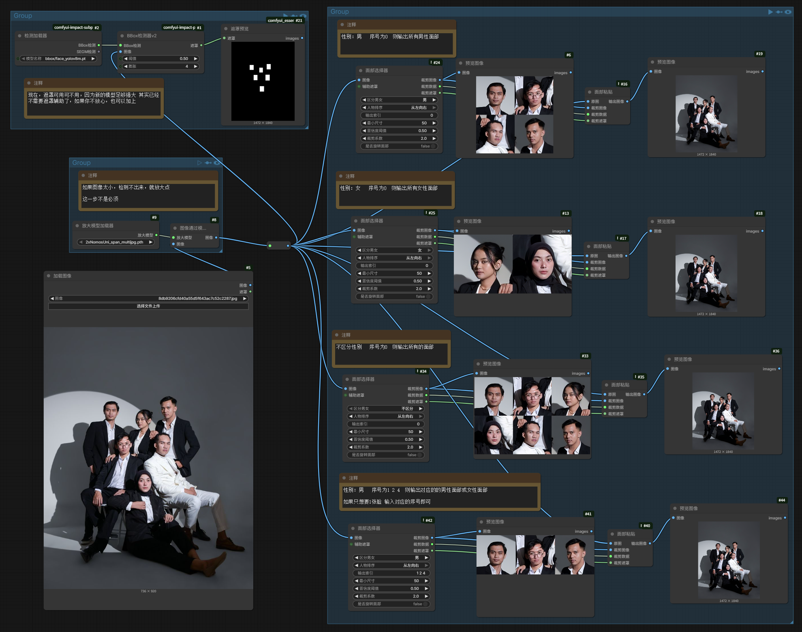
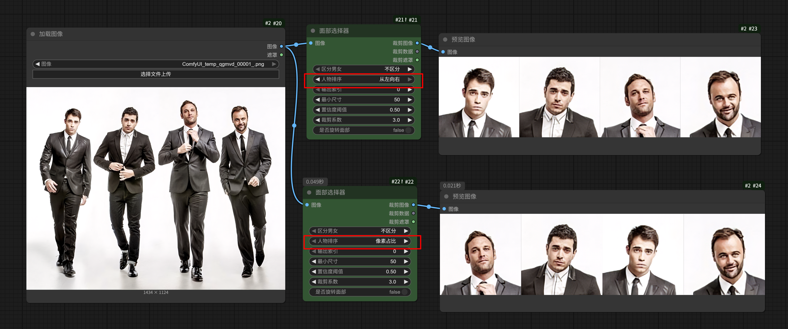
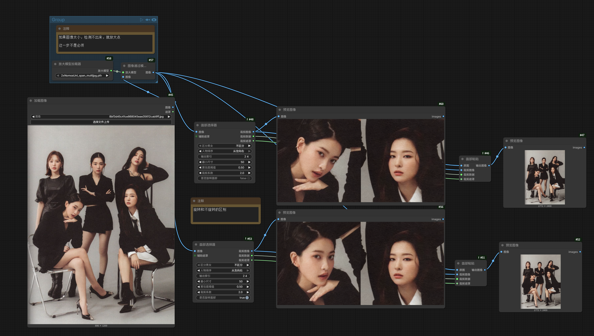

**核心功能：**

| 功能 | 说明 |
|------|------|
| **人脸检测** | 基于UniFace RetinaFace (ONNX, ~3.5MB)，检测速度快（~36ms/图） |
| **性别识别** | 基于UniFace AgeGender (~8MB)，自动预测每张脸的性别和年龄 |
| **多脸索引输出** | 支持 `1 3 5`、`2,4,6`、`0`(全部) 等多序号输入，空格/中英文逗号分隔，如果只想要1张脸 输入对应的序号即可|
| **智能旋转扶正** | 基于两眼关键点连线计算倾斜角，以每张脸各自中心为旋转点独立旋转，±5°以内不旋转 |
| **辅助遮罩** | 支持外接 mask（如 SAM/Impact 检测器输出），自动 IoU 配对优化边界框 |
| **性别过滤** | 可按男/女筛选，过滤后为空时自动回退到全部结果 |

**参数说明：**

- **区分男女**：`不区分 / 男 / 女` — 基于 AgeGender 模型预测结果筛选
- **人物排序**：`像素占比`（从大到小）/ `从左向右`（按 X 坐标）
- **输出索引**：`0`=全部，或如 `1 3`、`2,6`、`2，6` 等多序号
- **最小尺寸**：小于此值的人脸被忽略
- **置信度阈值**：过滤低置信度检测
- **裁剪系数**：默认 `2.0`，即按检测到的人脸框向外扩展至 2 倍大小
- **是否旋转面部**：开启后自动扶正每张歪斜的脸

### 🔄 面部粘贴

将处理后的脸部图像精确贴回原图。支持单张和批量粘贴。

- 自动处理旋转后的坐标逆变换，避免黑边
- 使用遮罩实现自然融合，不破坏周围像素
- 与面部选择器节点的数据格式完全匹配

### 📦 所需模型

| 模型 | 大小 | 说明 |
|------|------|------|
| RetinaFace MNET_V2 | ~3.5MB | 人脸检测 + 5点关键点（两眼、鼻、两口角） |
| AgeGender | ~8MB | 性别(0=女/1=男) + 年龄预测 |

**模型权重会在首次运行时自动下载到 `~/.uniface/models/`。

### ⚠️ 注意事项

- 面部选择器节点名称已统一为 **"面部选择器"**（原高级节点合并替代旧版）
- 不再依赖旧节点 MediaPipe / DeepFace，新节点使用模型为 UniFace 
- 遮罩辅助接口可连接任意 mask 输出源（Segment Anything、ImpactPack 等）
- 旋转功能对多脸图片逐脸独立计算角度和中心点，互不干扰

以下是一些我自己常用的一些节点分享,这些节点都是AI写的,全中文实现节点。

## 1,音频节点: audio_to_fps 音频到FPS转换,
功能是,获取音频时长(以秒为单位)并输出,设置帧率和因数之后,输出与时长对应的FPS数值,这在一些对口型,或者数字人生成的工作流程中相当有用
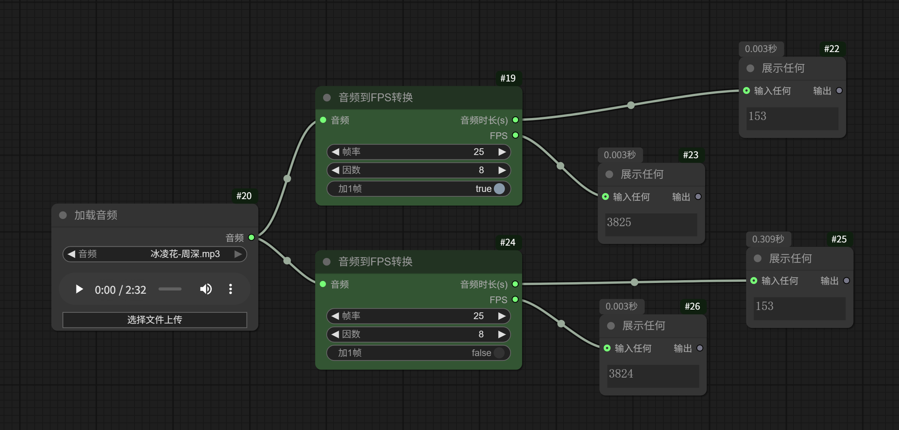

## 2,文件节点: file_reader 文件夹读取器, save_files_to_local 保存文件(列表)到本地,
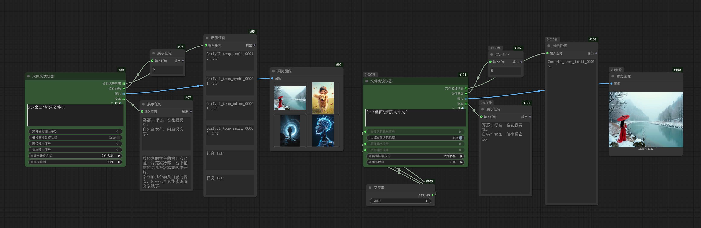
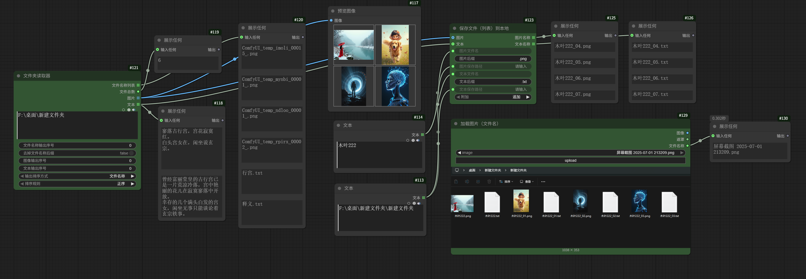

## 3,图像节点: image_blending_mode 图像混合模式, load_image 加载图片(文件名), remove_alpha_channel 移除透明通道,
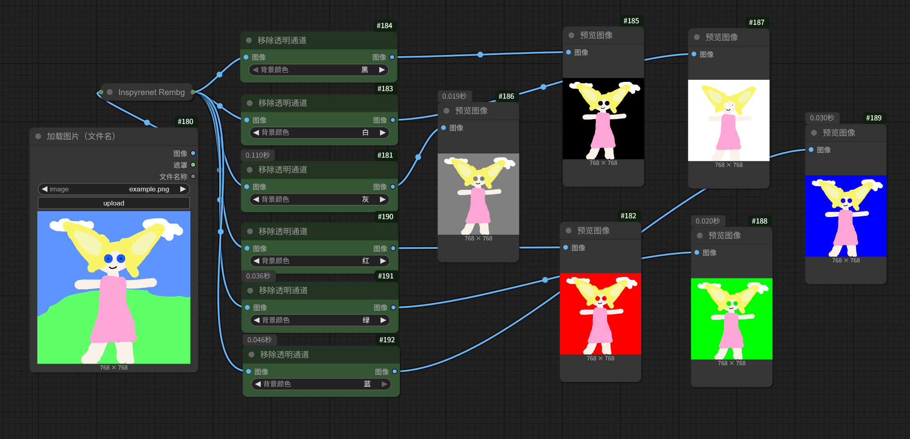
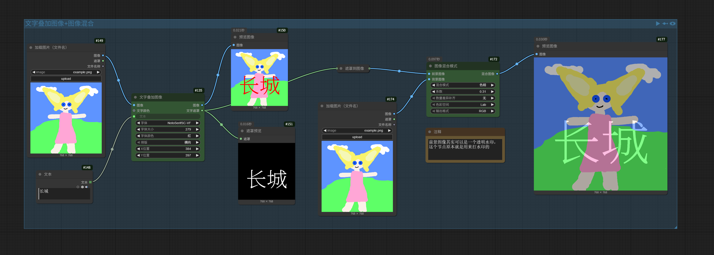

## 4,遮罩节点: mask_colorize 遮罩区域上色,mask_concatenate 遮罩拼接,mask_fill_holes 遮罩填充漏洞, mask_merge_list 遮罩合并(列表)
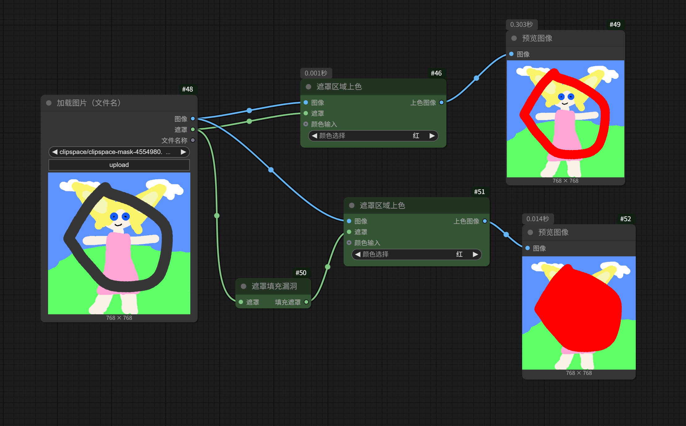
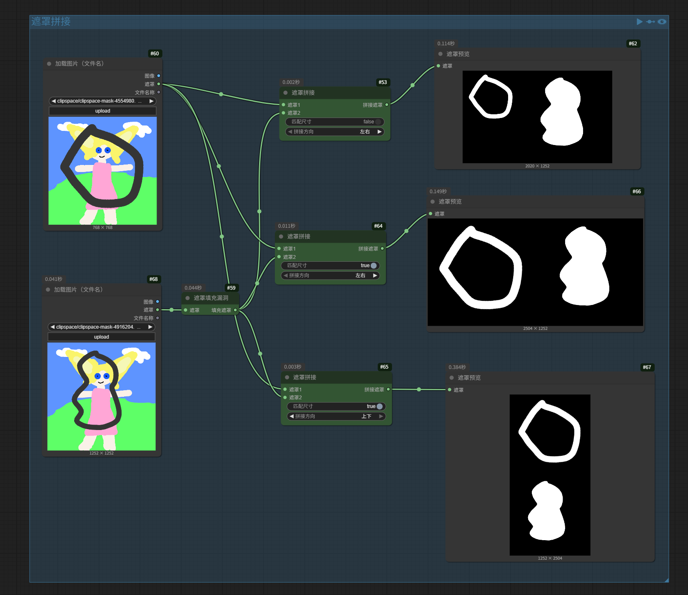
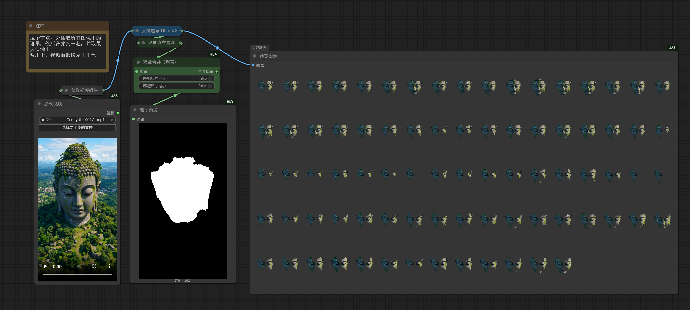

## 5,文本节点: batch_text_replace 批量文本替换, text_edit_output 文本, split_list 文本列表拆分, text_overlay_image 文字叠加图像,text_split_delimiter 文本按分隔符分割
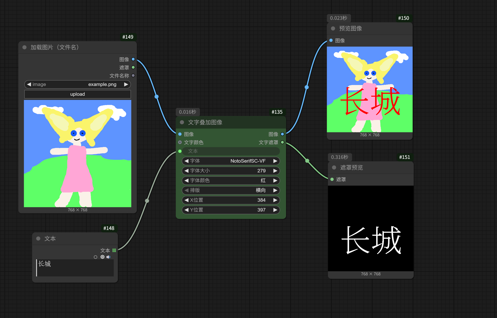
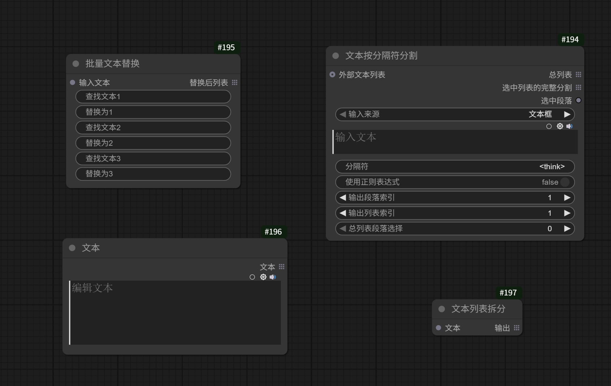

## 6.,额外节点: math_calculator 数学表达式计算,size_selector 尺寸选择器
### 数学表达式:
支持整数,文本,浮点作为输入,然后进行运算,拥有5个输入接口
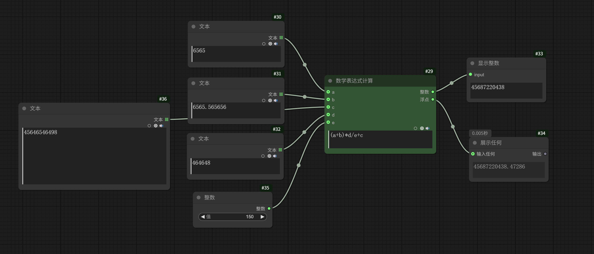

###  尺寸选择器 :
主要功能

尺寸优先级为: 左侧输入端口>边长覆盖>分辨率预设

提供丰富的分辨率预设(如 16:9、4:3、1:1 等常见比例),一键选择。

支持自定义输入宽度、高度,或通过比例字符串(如"3:2","2.39/1","2 3"等) 灵活指定宽高比。

可设置"长边覆盖",自动按比例调整另一边,适合需要指定最大边长的场景。如果输入了比例和长边,节点会自动计算出合适的宽高。

支持"因数"参数,自动将分辨率调整为某个数的倍数,方便兼容模型输入要求。所有分辨率都会根据"因数"参数自动对齐,保证兼容性。

支持批量生成(批次大小)和多帧(帧数)设置,兼容图片和视频生成任务。并自动限制最大分辨率,防止显存溢出。

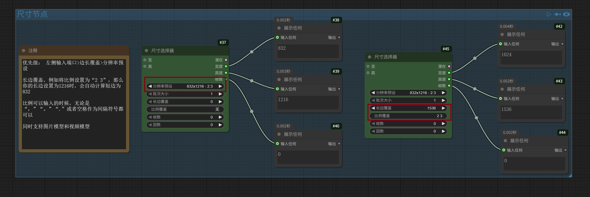 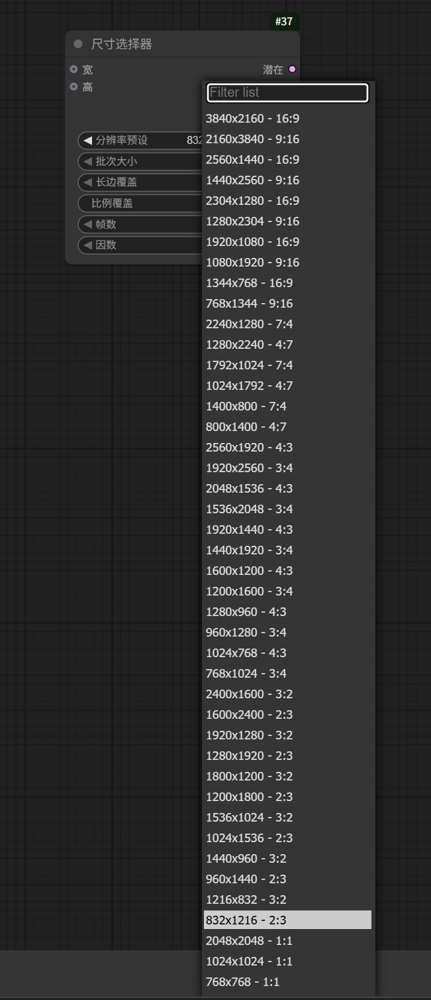

###  安装:
将本仓库克隆到 你的.\ComfyUI\custom_nodes\ 文件夹下
cd xx\ComfyUI\custom_nodes
git clone https://github.com/muyexiuluo/ComfyUI_Muye.git
然后安装下 requirements.txt 文件中的依赖就行了

